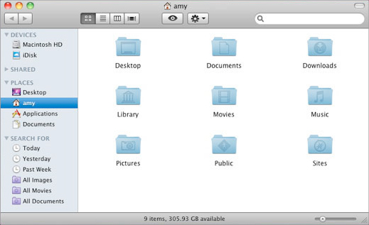
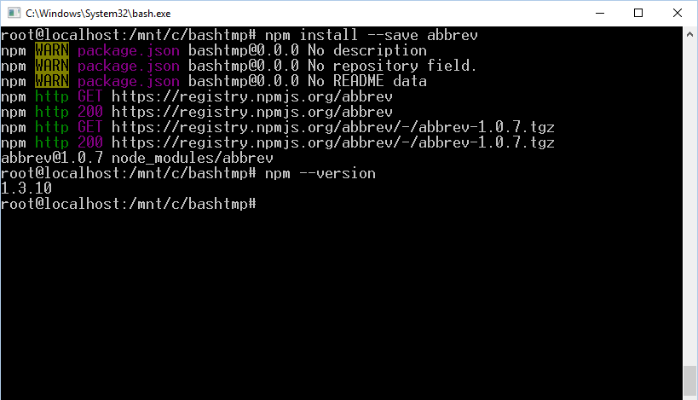

# 쉘과 명령어

---

## Shell

- 운영체제 기능을 사용할 수 있도록 접점의 역할을 하는 프로그램
- GUI(Graphical User Interface) 쉘로는 **탐색기**(Windows), **파인더**(macOS) 등이 있다.
- CLI(Command Line Interface) 쉘로는 **명령 프롬프트**, **Power Shell**, **Bash** 등이 있다.

---

## Finder

---

## Bash

---

## Bash 실행하기

- macOS - **Terminal**
- Windows - **Git Bash**

주의! Git Bash는 Git이라는 도구를 원활히 사용할 수 있도록 리눅스의 Bash 쉘 환경을 **흉내낸** 프로그램으로, 일부 기능의 사용에 제약이 있을 수 있습니다.

---

## 작업 디렉터리 확인

Bash 실행 후, 아래 명령을 입력하고 엔터를 쳐 봅시다.

- `pwd`
- `ls`

`pwd`는 *print working directory*의 줄임말, `ls`는 *list*의 줄임말입니다.

---

## 작업 디렉터리 (Working Directory)

- 프로그램 실행 시 지정되는 디렉터리
- 프로그램이 다른 파일을 필요로 할 때, **작업 디렉터리를 기준**으로 파일에 접근할 수 있습니다.
- Bash 역시 실행 시 작업 디렉터리를 가지고 실행됩니다.

---

## 작업 디렉터리 변경하기

다음 명령을 순서대로 실행해보세요.

- `cd Documents && pwd`
- `cd .. && pwd`
- `cd / && pwd`
- `cd ~ && pwd`

`&&` 기호는 여러 명령을 순서대로 실행하고 싶을 때 사용합니다.

---

## 경로 (Path)

- 파일 및 디렉터리의 위치를 나타내는 문자열 형식
- 트리 형태의 계층 구조를 이용해 위치를 표현
- Windows에서는 backslash(`\`) 문자를, 다른 운영체제에서는 slash(`/`) 문자를 이용해 계층 구조를 표현
  - `/Users/seungha/Documents/hello.txt`
  - `C:\Users\seungha\Documents\hello.txt`

---

## 상대 경로

- **작업 디렉터리를 기준**으로 위치를 표현하는 방식
- 대개 아래의 기호로 시작함
  - `.` - 작업 디렉터리를 나타냄
  - `..` - 작업 디렉터리의 상위 디렉터리를 나타냄

---

## 절대 경로

- **작업 디렉터리와 상관 없이** 위치를 표현
- 대개 아래의 기호로 시작함
  - `/` - 루트 디렉터리
  - `~` - 홈 디렉터리

---

## 경로 예시

- `./src/index.js`
- `../Downloads/curriculum.xls`
- `/etc/profile`
- `~/.bashrc`

---

## Tip - Bash의 자동 완성 기능

- 홈 디렉터리에서 `cd Dow` 까지만 입력하고 탭(tab) 키를 눌러보세요.
- 위쪽 화살표를 몇 번 눌러보세요. 그 뒤 아래쪽 화살표를 몇 번 눌러보세요.

---

## Tip - 명령 시 옵션 주기

- `ls -a` 명령을 실행해보세요.
- `ls -l` 명령을 실행해보세요.
- `ls -al` 명령을 실행해보세요.

다른 많은 명령들도 비슷한 방식을 통해 실행 시 옵션을 설정할 수 있습니다. 

---

## Tip - 명령의 사용법 알아보기

각 명령의 자세한 사용법을 알고 싶다면 `man <명령>` 명령을 실행해보세요. (macOS, Linux만 해당)

Windows 사용자는 [이 웹 사이트](https://linux.die.net/man/)를 통해 검색해보세요.

---

## Tip - 에러 메시지

쉘 및 여러 CLI 프로그램은 사용자가 프로그램을 잘못 사용했을 때 적절한 에러 메시지를 표시해줍니다. Bash에서 `fastcampus` 명령을 실행하려고 시도해보시고, 어떤 에러 메시지가 출력되는지 살펴보세요.

---

## 파일 및 디렉터리 조작

- `cp`
- `mv`
- `touch`
- `mkdir`
- `rm`
- `rmdir`

---

## 파일의 내용 표시

- `cat`
- `less`
- `tail`

---

## 문자열 표시

- `echo`

---

## 종료

- `exit`

---

## GUI 쉘을 통해 파일 실행시키기

- macOS - `open`
- Windows - `start`

---

## 텍스트 편집

- `nano`
- `vim`
