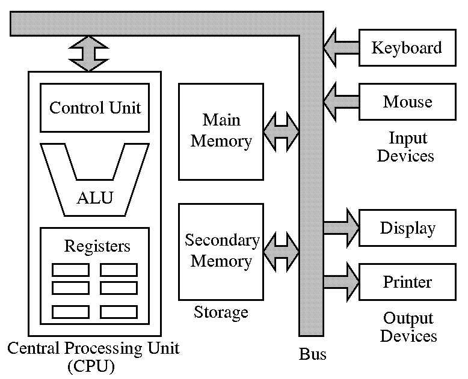

# 컴퓨터 구조

---

## 컴퓨터 구조

---

## CPU (Central Processing Unit)

- 컴퓨터 시스템 전체를 제어하는 장치 - 두뇌!
- 실질적인 계산을 담당
- **기계어**로 작성된 프로그램을 실행시킬 수 있음

---

## 기억 장치의 구분

- 주 기억 장치
  - **실행 중인 프로그램** 및 그 프로그램이 필요로 하는 **데이터**가 저장되는 기억 장치
  - 보통 RAM(Random Access Memory)이 사용됨
  - 빠르다 / 비싸다 / 용량이 작다 / 휘발성이다

---

## 기억 장치의 구분

- 보조 기억 장치
  - **실행 중이 아닌 프로그램** 및 **데이터**가 저장되는 기억 장치
  - 보통 HDD 혹은 SSD가 사용됨
  - 느리다 / 저렴하다 / 용량이 크다 / 비휘발성이다

---

## Tip - 듀얼 코어? 쿼드 코어?

- CPU에는 프로그램 실행을 위한 처리 장치, 즉 **코어(core)**가 여러 개 내장되어 있을 수 있고, 이런 CPU를 **멀티 코어**라고 합니다.
- 코어의 개수만큼 동시에 실행할 수 있는 프로그램의 개수가 늘어나므로, 성능 향상에 도움이 됩니다.

---

## Tip - 32비트, 64비트?

- CPU가 **한 번에 연산할 수 있는** 데이터의 크기
- 비트 수가 늘어나면 프로그램을 실행하는 데 필요한 **연산 횟수**를 줄일 수 있으므로, 성능 향상에 도움이 됩니다.
- 최근 출시되는 컴퓨터 및 스마트폰은 대개 64비트 CPU를 탑재하고 있습니다.
- 참고 - [정수형](https://ko.wikipedia.org/wiki/%EC%A0%95%EC%88%98%ED%98%95)

---

## Tip - GPU?

- "Graphics Processing Unit"
- 화면을 그리기 위한 **수치 연산**에 특화된 연산 장치
- 최근 출시되는 고성능 GPU의 코어 개수는 **수백~수천 개**
- CPU 안에 내장되기도 하고, 별도의 그래픽 카드로 사용되기도 함
- 최근에는 빠른 수치 연산이 필요한 분야(**머신 러닝** 혹은 **코인 채굴**)에서 GPU가 활용되기도 함

---

## Tip - 개발용 노트북 구입하기!

- i5 이상, 쿼드코어 이상
  - 인텔 8세대(i5-8XXX)가 최근에 출시됨
  - 8세대 i5는 모두 쿼드코어
- SSD 256GB 이상
- RAM 8GB 이상

---

참고 - [앨런 튜링과 폰 노이만](https://joone.net/2016/11/15/%EC%95%A8%EB%9F%B0-%ED%8A%9C%EB%A7%81%EA%B3%BC-%ED%8F%B0%EB%85%B8%EC%9D%B4%EB%A7%8C/)